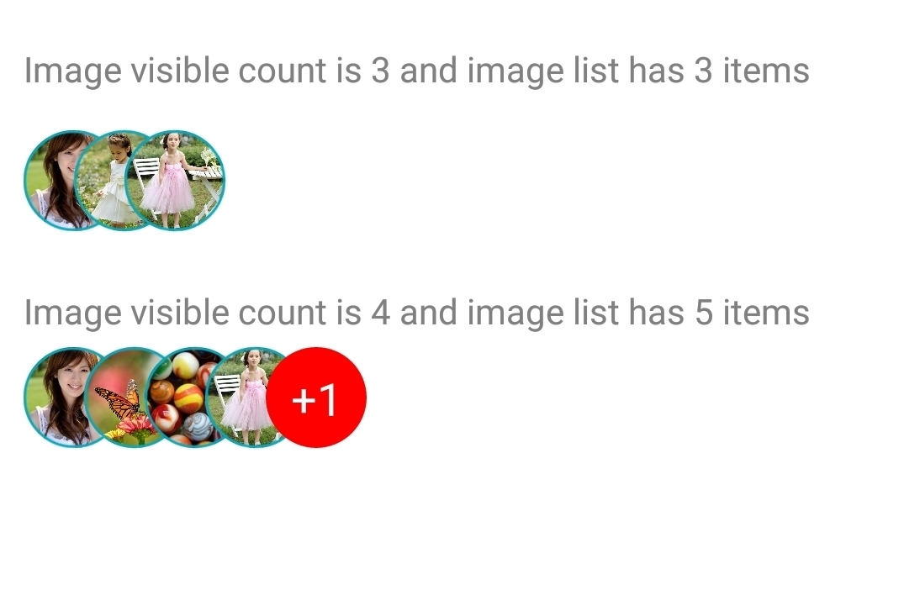

<h1>Introduction</h1>

INTUZ is presenting an interesting React Native component to represent your array of images in magnificent overlapping style of pattern to add a modern design touch to your iOS & Android based applications. Please follow below steps to integrate this control in your next project.

<br>
<h1>Features</h1>

- Support for array of URL and/or local path of images
- Set height of ImageView
- Control distance between two Images
- Customize border width and color for ImageView
- Set defualt visible images count


<br>


<h1>Getting Started</h1>

> Import ImageOverlapView in your .js file

```
import ImageOverlapView from './app/component/ImageOverlapView'     
```

> Define your Images array

```
  var photos  = [require('./app/images/profile1.jpg'),
                  "https://googlechrome.github.io/samples/picture-element/images/butterfly.jpg",
                  "https://physics.aps.org/assets/8e06ab76-1239-4b4c-9f4f-a468e4529051/e18_1_medium.jpg",
                  require('./app/images/profile2.jpg'),
                  require('./app/images/profile3.jpg'),
                 ];
```

> Render ImageOverlapView

```
 <ImageOverlapView 
    photos = {photos}
    height={40} 
    borderColor={'#00ACC1'} 
    borderWidth={1}
    defaultVisibleCount={3}                
    countBackgroundColor={'#00ACC1'}
    countStyle = {{color: 'white', fontSize: 18}} >
 </ImageOverlapView>
```

<br>
<h1>Properties</h1>

| Available properties | Type | Default Value | Required | Description |
|--------------------------|------------------------|-------------------------------|----------|-------------------------------------------------------------------------------------------------------------------------------------------------------------------------|
| photos | Array | - | Yes | An array of Photo, which can be any type of Url or object |
| Height | Number | 50 | No | The Height of the ImageView |
| borderColor | String | black | No | The border-color of Image-view |
| borderWidth | Number | 1 | No | The border-width of  Image-view |
| defaultVisibleCount | Number | 1 | No | Number of photo visible in Image-view list |
| displayPercentage | Number | 50 | No | The display-percentage is spacing between two  Image-views |
| countBackgroundColor | String | red | No  | Background-color of remaining imageCount-view |
| countStyle | Style | {color:’white’,fontSize : 16} | No | The Textview style what you set and it will override the default |                                                                                                        |
<br>
<h1>Bugs and Feedback</h1>

For bugs, questions and discussions please use the Github Issues.

<br>
<h1>License</h1>

Copyright (c) 2018 Intuz Solutions Pvt Ltd.
<br><br>
Permission is hereby granted, free of charge, to any person obtaining a copy of this software and associated documentation files (the "Software"), to deal in the Software without restriction, including without limitation the rights to use, copy, modify, merge, publish, distribute, sublicense, and/or sell copies of the Software, and to permit persons to whom the Software is furnished to do so, subject to the following conditions:
<br><br>
THE SOFTWARE IS PROVIDED "AS IS", WITHOUT WARRANTY OF ANY KIND, EXPRESS OR IMPLIED, INCLUDING BUT NOT LIMITED TO THE WARRANTIES OF MERCHANTABILITY, FITNESS FOR A PARTICULAR PURPOSE AND NONINFRINGEMENT. IN NO EVENT SHALL THE AUTHORS OR COPYRIGHT HOLDERS BE LIABLE FOR ANY CLAIM, DAMAGES OR OTHER LIABILITY, WHETHER IN AN ACTION OF CONTRACT, TORT OR OTHERWISE, ARISING FROM, OUT OF OR IN CONNECTION WITH THE SOFTWARE OR THE USE OR OTHER DEALINGS IN THE SOFTWARE.

<h1></h1>
<a href="http://www.intuz.com">

</a>